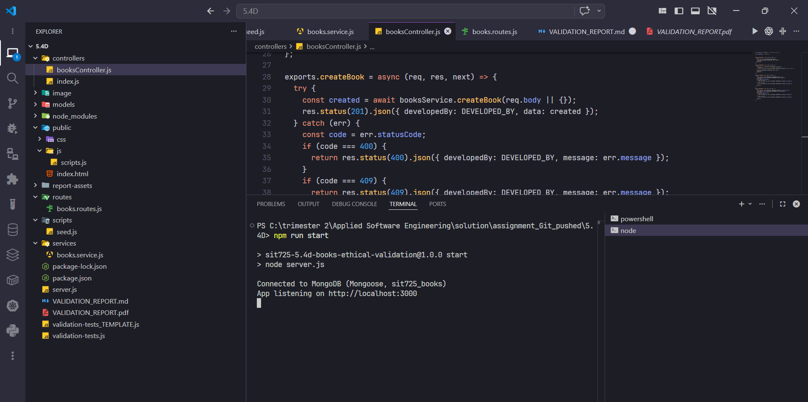
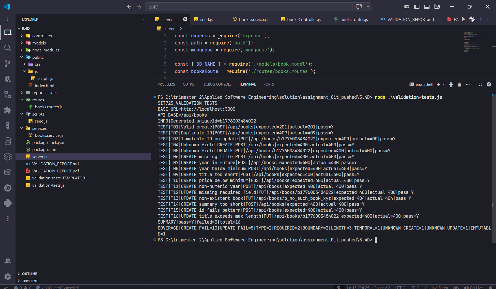

# SIT725 5.4D — Report

## Repository link

https://github.com/omjagtap100/SIT725_s225435163/5.4D

## Screenshots (running code)

**Figure 1 — API server running (local `node server.js`): console shows MongoDB connection and listen URL.**

**Figure 2 — Automated validation suite (`node validation-tests.js`): all tests pass against `http://localhost:3000`.**

## Table of validation rules (by field)

| Field             | Rule (name and description)                                                                                                                                                                                                      | Justification and quality impact                                                                                                                                                                        |
| ----------------- | -------------------------------------------------------------------------------------------------------------------------------------------------------------------------------------------------------------------------------- | ------------------------------------------------------------------------------------------------------------------------------------------------------------------------------------------------------- |
| **id**      | **Required, stable identifier** — must be present on create; trimmed string; max 64 characters; must match `^b[a-zA-Z0-9_-]+$` (starts with `b`, then letters, digits, hyphen, underscore); unique in the collection. | Enforces a predictable, URL-safe primary key for books and prevents collisions. Clear format rules make IDs easy to validate in routes, document in APIs, and test; uniqueness protects data integrity. |
| **title**   | **Required text with length bounds** — trimmed; minimum 2 characters; maximum 300 characters.                                                                                                                             | Stops empty or meaningless titles and caps payload size for storage and UI. Improves consistency of list/detail views and reduces abuse via huge strings.                                               |
| **author**  | **Required text with length bounds** — trimmed; minimum 2 characters; maximum 200 characters.                                                                                                                             | Ensures every book has a credible author string and keeps records bounded for search and display.                                                                                                       |
| **year**    | **Required integer in a valid publication range** — must be an integer from 1000 through the current calendar year (inclusive).                                                                                           | Rejects nonsensical or future publication years and non-integers (e.g. strings), which improves data quality for sorting, filtering, and reporting.                                                     |
| **genre**   | **Required category string** — trimmed; minimum 2 characters; maximum 100 characters.                                                                                                                                     | Guarantees a non-trivial genre for classification while limiting length for consistent UX and storage.                                                                                                  |
| **summary** | **Required description with length bounds** — trimmed; minimum 10 characters; maximum 20,000 characters.                                                                                                                  | Forces a real synopsis (not a single word) yet allows long blurbs; reduces junk records and defines a clear contract for front-end and API consumers.                                                   |
| **price**   | **Required AUD amount in range** — stored as `Decimal128`; must parse to a finite number between **0.01** and **999999.99** (inclusive).                                                                    | Avoids negative, zero, or astronomically large prices and uses a decimal type suited to money, reducing rounding and floating-point errors in persistence.                                              |

*Additional service-layer rules (not separate schema fields):* create requests must include **only** `id`, `title`, `author`, `year`, `genre`, `summary`, `price`; update requests must include **only** `title`, `author`, `year`, `genre`, `summary`, `price` and **must not** send `id` in the body (immutable). These reduce surprise fields and keep the API contract explicit.

## Endpoints implemented for validation (safe writes)

Safe-write endpoints are those that **mutate** server-side state and run validation before persisting.

### `POST /api/books` — create book

- **Purpose:** Create one book document when the body satisfies field rules and allowed keys.
- **Success:** **201 Created** — JSON body: `{ "developedBy": "<student id>", "data": { ...book } }` where `data` matches the stored book (including `price` as a string in JSON output per schema transform).
- **Client / validation errors:** **400 Bad Request** — `{ "developedBy": "<student id>", "message": "<human-readable reason>" }` for missing/unknown fields, schema validation failures, or type errors (e.g. cast).
- **Conflict:** **409 Conflict** — same envelope with a message when `id` already exists (duplicate key).
- **Server failure:** **500** — generic server error envelope from the Express error handler.

*Justification:* **201** is the correct semantics for a new resource; **400** separates bad input from **409** (duplicate business key); **500** isolates unexpected failures from predictable validation outcomes.

### `PUT /api/books/:id` — replace/update book fields

- **Purpose:** Update an existing book identified by the path parameter `:id`; body must supply all updatable fields and must not attempt to change `id`.
- **Success:** **200 OK** — `{ "developedBy": "<student id>", "data": { ...updated book } }`.
- **Client / validation errors:** **400 Bad Request** — same `{ developedBy, message }` shape for unknown fields, missing required update fields, `id` in body (immutable), schema validation, or cast errors.
- **Not found:** **404 Not Found** — same envelope when no book matches `:id`.
- **Server failure:** **500** — same as create.

*Justification:* **200** signals a successful full update of the resource; **400** vs **404** distinguishes bad payloads from a missing target; consistent JSON shape makes clients and automated tests (e.g. `validation-tests.js`) easier to rely on.
